# TRANLE TASKS — PHÂN TÍCH & THIẾT KẾ HỆ THỐNG
## Bộ sơ đồ đồ án môn IT / Phân tích & Thiết kế hệ thống

> **Hệ thống:** TranLe Tasks — Tran Le Electricity Management & Collaboration Platform  
> **Repository:** https://github.com/Manhphan07092002/tranle_tasks.git  
> **Website doanh nghiệp:** https://tranlecorp.com/  
> **Mục tiêu tài liệu:** chuyển cấu trúc hệ thống hiện tại thành một bộ phân tích & thiết kế hoàn chỉnh theo chuẩn đồ án môn Phân tích & Thiết kế hệ thống.
>
> **Nguồn phân tích repo:** `phan_tich.MD` và cấu trúc repository hiện tại. Repo đang là monorepo với React/Vite/Tailwind ở frontend, Express/TypeScript ở backend, MySQL 8, Socket.io, Gemini AI, mail IMAP/SMTP và Docker/PM2/Nginx cho triển khai. citeturn524105view1turn524105view2
>
> **Lưu ý:** sơ đồ dưới đây là mô hình mục tiêu/đề xuất để hoàn thiện hệ thống theo cơ cấu phòng ban. Những quan hệ chưa có đầy đủ trong code hiện tại được ghi rõ là **Target / Proposed** để AI triển khai.

---

# 1. PHẠM VI HỆ THỐNG

TranLe Tasks hiện được định hướng là nền tảng quản lý công việc, dự án và cộng tác nội bộ; repository hiện có các nhóm chức năng như Task Management, Calendar/Meetings, Team Directory, Mail, Reports/Dashboard, Admin, AI Assistant và realtime collaboration. citeturn992973view0

Phần backend hiện có các route cho `tasks`, `projects`, `contracts`, `revenue`, `products`, `documents`, `meetings`, `roles`, `departments`, `users`, `reports`, `notifications`, `activity`, `events`, `upload`, `AI`, v.v. citeturn524105view2turn524105view3

Hệ thống mục tiêu bổ sung quản lý theo phòng ban:

```text
Company
│
├── Ban Giám đốc
├── Kinh doanh
├── Kỹ thuật / Engineering
├── Dự án / EPC
├── O&M / Bảo hành
├── Mua hàng
├── Kho & Logistics
├── Marketing
├── CSKH
├── Tài chính – Kế toán
├── HCNS
├── IT
└── Pháp chế / Hợp đồng
```

---

# 2. ACTOR CỦA HỆ THỐNG

## 2.1. Actor nội bộ

| Actor | Vai trò |
|---|---|
| Nhân viên | Thực hiện công việc, cập nhật tiến độ, báo cáo kết quả |
| Trưởng nhóm | Quản lý team, phân công và review |
| Trưởng phòng | Quản lý nghiệp vụ và KPI phòng |
| Project Manager | Quản lý tiến độ và thành viên dự án |
| Ban Giám đốc | Điều hành toàn công ty, xem KPI, phê duyệt |
| Admin/IT | Quản trị tài khoản, hệ thống, quyền |
| Kế toán | Quản lý doanh thu, chi phí, công nợ |
| HR | Quản lý nhân sự và tổ chức |
| Sales | Quản lý CRM, báo giá, hợp đồng |
| Engineering | Quản lý kỹ thuật, thiết kế |
| EPC | Quản lý triển khai dự án |
| Procurement | Quản lý mua hàng |
| Warehouse/Logistics | Quản lý kho, serial, giao nhận |
| O&M | Quản lý bảo trì, sự cố, bảo hành |
| Marketing | Quản lý nội dung, chiến dịch, social |
| CSKH | Quản lý yêu cầu và phản hồi khách hàng |
| Legal | Quản lý hợp đồng và pháp lý |

## 2.2. Actor bên ngoài

```text
Khách hàng
Nhà cung cấp
Đối tác
Hệ thống Email
Google Gemini API
Thiết bị/Browser
```

---

# 3. SƠ ĐỒ 1 — CONTEXT DIAGRAM

## 3.1. Mục đích

Thể hiện TranLe Tasks như một hệ thống trung tâm và các tác nhân trao đổi dữ liệu với hệ thống.

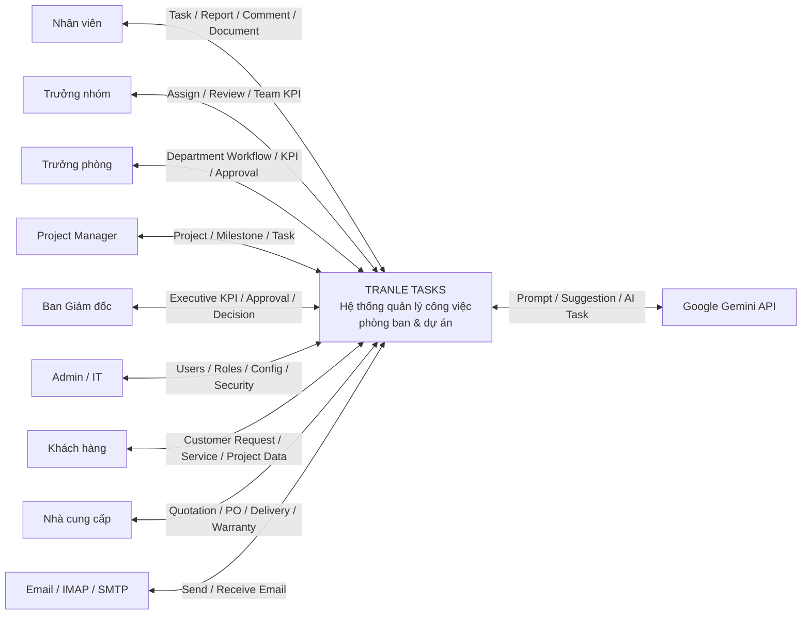

### Dữ liệu chính

```text
Người dùng → Task / Request / Report / Document / Comment
Trưởng phòng → Assignment / Approval / KPI
Ban Giám đốc → KPI / Decision / Approval
Khách hàng → Request / Project / Service Ticket
Nhà cung cấp → RFQ / Quotation / PO / Delivery
Email → Message / Attachment
Gemini → AI Suggestion / Task Template / Assistant
```

---

# 4. SƠ ĐỒ 2 — USE CASE DIAGRAM

## 4.1. Use Case cấp hệ thống

```mermaid
flowchart LR
    EMP["Nhân viên"]
    TL["Trưởng nhóm"]
    MGR["Trưởng phòng"]
    PM["Project Manager"]
    DIR["Ban Giám đốc"]
    ADM["Admin / IT"]
    SALES["Kinh doanh"]
    ENG["Kỹ thuật"]
    EPC["Dự án / EPC"]
    PROC["Mua hàng"]
    WH["Kho / Logistics"]
    OM["O&M"]
    FIN["Tài chính / Kế toán"]
    HR["HCNS"]
    CS["CSKH"]
    MKT["Marketing"]
    LEGAL["Pháp chế"]

    subgraph UC["TRANLE TASKS — USE CASES"]
        U1(("Đăng nhập / Xác thực"))
        U2(("Quản lý công việc"))
        U3(("Giao việc"))
        U4(("Cập nhật tiến độ"))
        U5(("Duyệt công việc"))
        U6(("Quản lý phòng ban"))
        U7(("Quản lý Team / Chức vụ"))
        U8(("Quản lý nhân sự"))
        U9(("Quản lý dự án"))
        U10(("Quản lý khách hàng"))
        U11(("Quản lý báo giá / Hợp đồng"))
        U12(("Quản lý mua hàng"))
        U13(("Quản lý kho / Logistics"))
        U14(("Quản lý O&M / Bảo hành"))
        U15(("Quản lý báo cáo / KPI"))
        U16(("Quản lý cuộc họp / Lịch"))
        U17(("Quản lý tài liệu"))
        U18(("Quản lý Email"))
        U19(("AI Assistant"))
        U20(("Quản trị người dùng / quyền"))
        U21(("Notifications / Activity"))
    end

    EMP --> U1
    EMP --> U2
    EMP --> U4
    EMP --> U16
    EMP --> U17
    EMP --> U18
    EMP --> U21

    TL --> U3
    TL --> U5
    TL --> U15

    MGR --> U3
    MGR --> U5
    MGR --> U6
    MGR --> U15

    PM --> U9
    PM --> U2
    PM --> U15

    DIR --> U9
    DIR --> U15
    DIR --> U5

    ADM --> U6
    ADM --> U7
    ADM --> U8
    ADM --> U20

    SALES --> U10
    SALES --> U11
    SALES --> U2

    ENG --> U2
    ENG --> U9
    EPC --> U9
    PROC --> U12
    WH --> U13
    OM --> U14
    FIN --> U11
    FIN --> U15
    HR --> U8
    CS --> U10
    MKT --> U15
    LEGAL --> U11
```

---

# 5. USE CASE PHÂN RÃ THEO ACTOR

## 5.1. Nhân viên

```text
Đăng nhập
Xem việc của tôi
Nhận việc
Cập nhật trạng thái
Cập nhật tiến độ
Comment
Mention
Upload tài liệu
Xem lịch
Tham gia họp
Tạo báo cáo
Xem thông báo
Dùng AI Assistant
```

## 5.2. Trưởng nhóm

```text
Xem công việc team
Tạo task
Giao task
Đổi người thực hiện
Theo dõi workload
Review kết quả
Duyệt task
Xem KPI team
```

## 5.3. Trưởng phòng

```text
Quản lý công việc phòng
Quản lý thành viên phòng
Quản lý team
Phân công
Review
Approval
Theo dõi project
Theo dõi KPI
Báo cáo phòng
```

## 5.4. Ban Giám đốc

```text
Xem toàn công ty
KPI
Revenue
Projects
Department Performance
Approval
Decision
Risk
Issue
Executive Report
```

## 5.5. Admin/IT

```text
Users
Departments
Teams
Positions
Roles
Permissions
System Config
Audit
Security
```

---

# 6. SƠ ĐỒ 3 — ACTIVITY DIAGRAM NGHIỆP VỤ TRUNG TÂM

## 6.1. Luồng giao việc

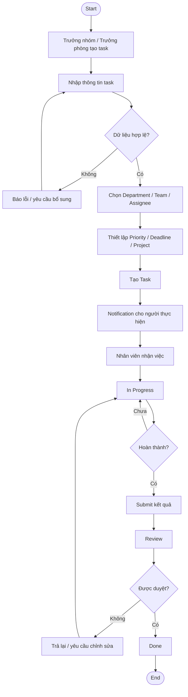

---

# 7. ACTIVITY — WORKFLOW SALES → ENGINEERING → EPC

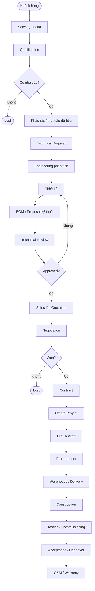

---

# 8. ACTIVITY — XỬ LÝ SERVICE TICKET

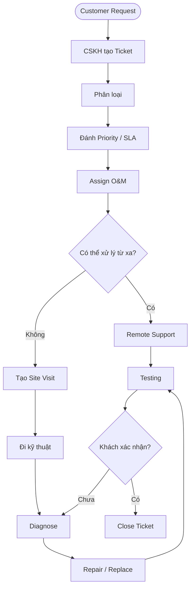

---

# 9. SƠ ĐỒ 4 — SEQUENCE DIAGRAM

## 9.1. Đăng nhập

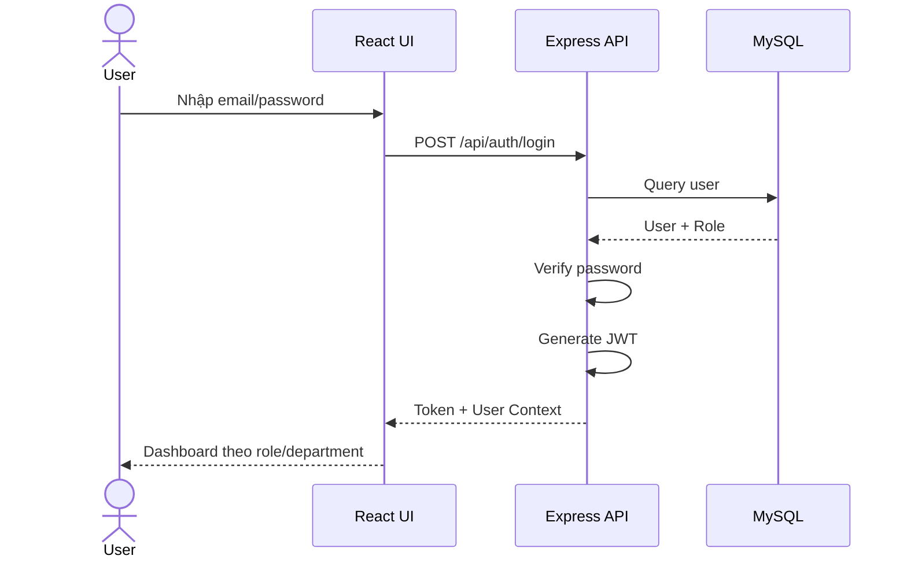

## 9.2. Tạo và giao Task

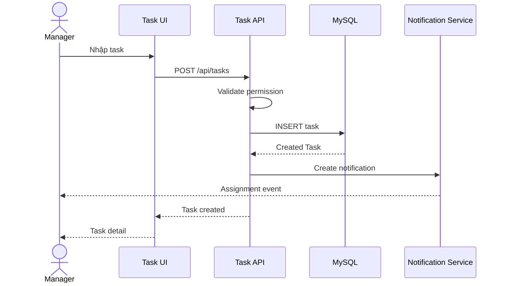

## 9.3. Approval

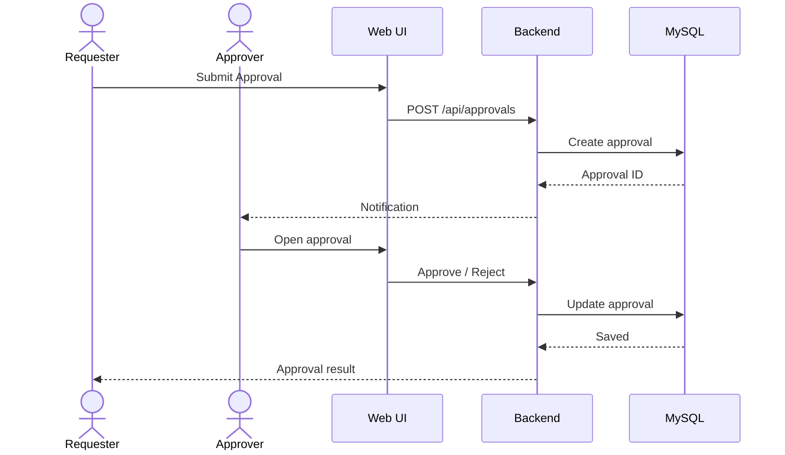

## 9.4. Cross-department Request

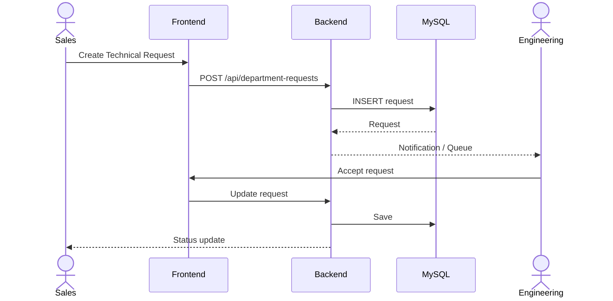

---

# 10. SƠ ĐỒ 5 — CLASS DIAGRAM

> Mô hình mục tiêu theo hướng domain. Không nhất thiết trùng 100% class hiện tại trong source.

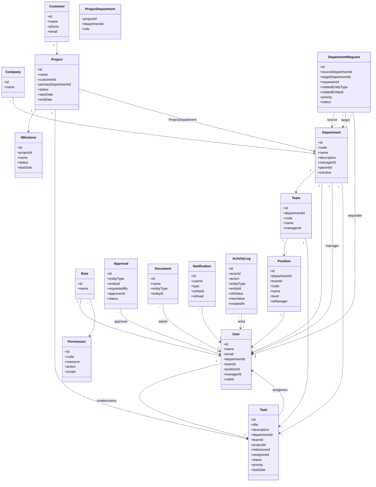

---

# 11. SƠ ĐỒ 6 — ERD

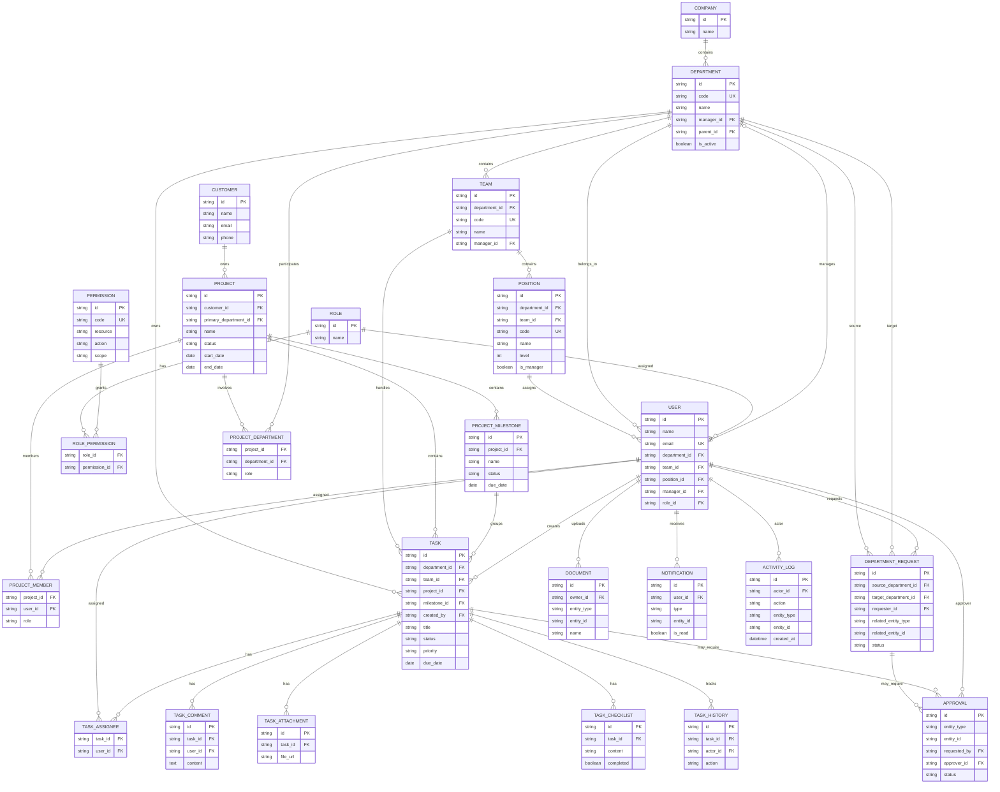

---

# 12. SƠ ĐỒ 7 — DFD LEVEL 0

## 12.1. Tiến trình tổng quát

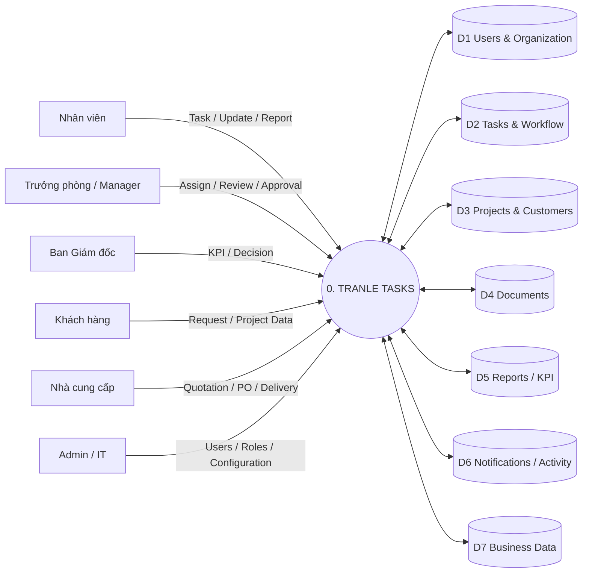

---

# 13. DFD LEVEL 1

Phân rã hệ thống thành các tiến trình:

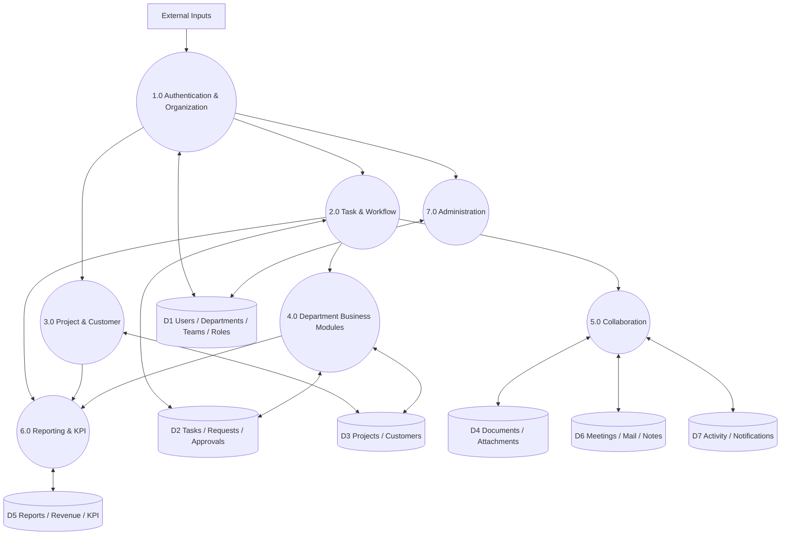

---

# 14. DFD LEVEL 2 — QUẢN LÝ CÔNG VIỆC

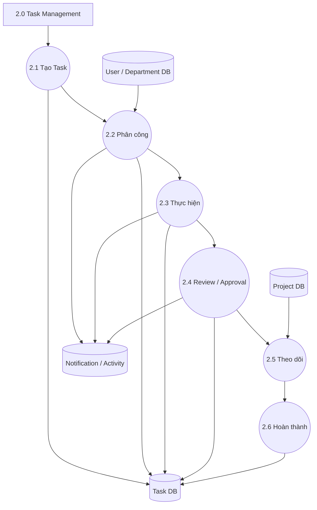

---

# 15. SƠ ĐỒ 8 — COMPONENT DIAGRAM

Repo hiện dùng React/Vite/Tailwind/TypeScript ở frontend; backend Express/TypeScript; MySQL 8; Socket.io; Gemini; Nodemailer/IMAPFlow; Docker/PM2/Nginx. citeturn524105view1

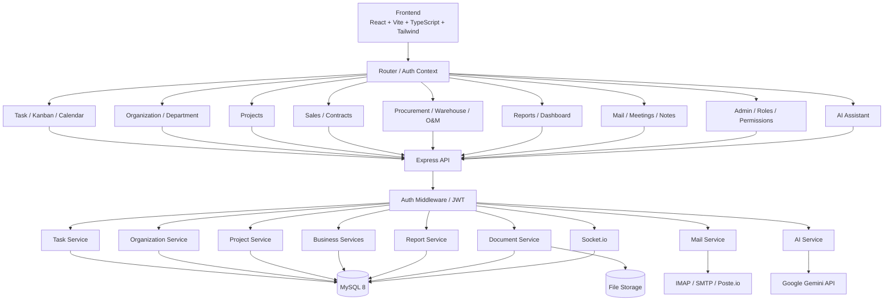

---

# 16. SƠ ĐỒ 9 — DEPLOYMENT DIAGRAM

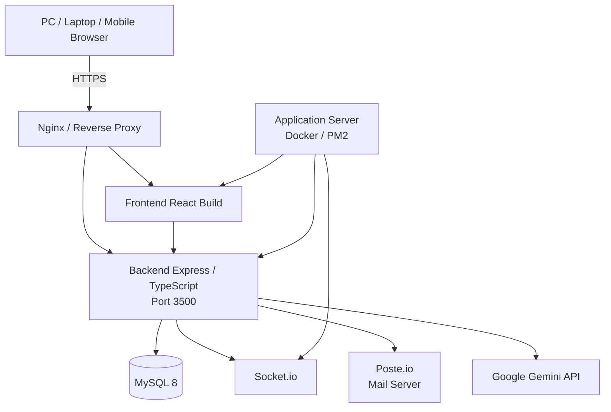

Repo hiện mô tả Docker gồm App + MySQL 8 + Poste.io, cùng PM2/Nginx cho deployment. citeturn524105view1

---

# 17. SƠ ĐỒ 10 — ARCHITECTURE DIAGRAM

## 17.1. Kiến trúc phân lớp

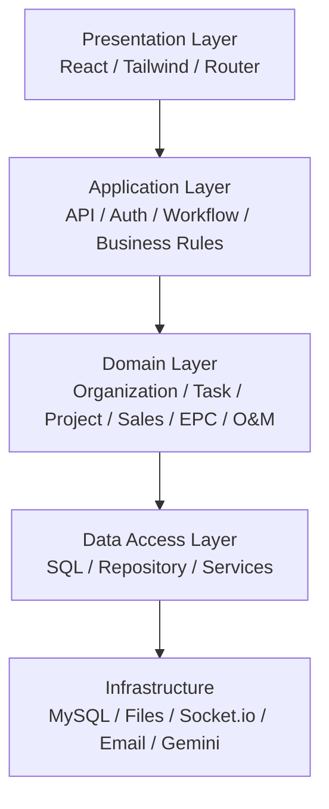

## 17.2. Kiến trúc nghiệp vụ

```text
                    BAN GIÁM ĐỐC
                          │
                   COMPANY KPI
                          │
        ┌─────────────────┼─────────────────┐
        │                 │                 │
     ORGANIZATION       WORK             CONTROL
        │                 │                 │
 Department/Team      Task/Project     Role/Permission
        │                 │                 │
        └─────────────────┼─────────────────┘
                          │
                    WORKFLOW ENGINE
                          │
              ┌───────────┼────────────┐
              │           │            │
           Request      Approval      SLA
              │           │            │
              └───────────┼────────────┘
                          │
                     REPORT / KPI
```

---

# 18. SƠ ĐỒ 11 — QUAN HỆ GIỮA CÁC PHÒNG BAN

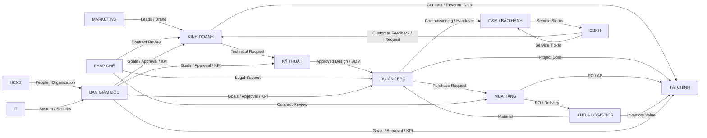

---

# 19. SƠ ĐỒ 12 — END-TO-END BUSINESS PROCESS

Đây là sơ đồ nên đặt ở đầu phần phân tích nghiệp vụ.

```text
                         ┌─────────────────┐
                         │   BAN GIÁM ĐỐC  │
                         │ KPI / APPROVAL  │
                         └────────┬────────┘
                                  │
                                  ▼
                         ┌─────────────────┐
                         │    KINH DOANH   │
                         │ CRM / LEAD /    │
                         │ QUOTATION        │
                         └────────┬────────┘
                                  │
                           Technical Request
                                  ▼
                         ┌─────────────────┐
                         │    KỸ THUẬT     │
                         │ SURVEY / DESIGN │
                         │ BOM / REVIEW    │
                         └────────┬────────┘
                                  │
                           Approved Package
                                  ▼
                         ┌─────────────────┐
                         │     EPC         │
                         │ PROJECT / SITE  │
                         │ QAQC / HSE      │
                         └───────┬─┬───────┘
                                 │ │
                  Purchase       │ │ Materials
                                 │ │
                                 ▼ ▼
                           ┌──────────────┐
                           │ MUA HÀNG     │
                           └──────┬───────┘
                                  │
                                 PO
                                  ▼
                           ┌──────────────┐
                           │ KHO/LOGISTICS│
                           └──────┬───────┘
                                  │
                              Delivery
                                  ▼
                               EPC
                                  │
                           Commissioning
                                  ▼
                           ┌──────────────┐
                           │ O&M/WARRANTY │
                           └──────┬───────┘
                                  │
                                  ▼
                               CSKH
```

Phòng hỗ trợ:

```text
              ┌──────────┐
              │ FINANCE  │
              └────┬─────┘
                   │
              toàn bộ hoạt động

              ┌──────────┐
              │   HR     │
              └────┬─────┘
                   │
              nhân sự / tổ chức

              ┌──────────┐
              │   IT     │
              └────┬─────┘
                   │
              hệ thống / bảo mật

              ┌──────────┐
              │ MARKETING│──→ LEAD / BRAND
              └──────────┘

              ┌──────────┐
              │  LEGAL   │──→ CONTRACT
              └──────────┘
```

---

# 20. TRẠNG THÁI CÔNG VIỆC

```text
BACKLOG
   ↓
TODO
   ↓
IN PROGRESS
   ├── BLOCKED
   └── WAITING
   ↓
REVIEW
   ↓
APPROVED
   ↓
DONE
```

Nhánh hủy:

```text
ANY STATE → CANCELLED
```

---

# 21. MÔ HÌNH PHÊ DUYỆT

```text
Employee / Department
          │
          ▼
    Request / Task
          │
          ▼
    Pending Approval
          │
      ┌───┴────┐
      ▼        ▼
   Approved  Rejected
      │        │
      ▼        ▼
 Next Step   Revision
```

Approval được dùng cho:
- Báo giá.
- Chiết khấu.
- Mua hàng.
- Thanh toán.
- Hợp đồng.
- Kỹ thuật.
- Dự án.
- Nghỉ phép.
- Quyền truy cập.

---

# 22. MÔ HÌNH PHÂN QUYỀN

```text
USER
 │
 ├── ROLE
 │     │
 │     └── PERMISSION
 │
 ├── DEPARTMENT SCOPE
 │
 ├── TEAM SCOPE
 │
 └── PROJECT SCOPE
```

### Ma trận cấp quyền

| Cấp | Scope |
|---|---|
| Employee | Own / Assigned |
| Team Leader | Team |
| Department Manager | Department |
| Project Manager | Project |
| Director | Company |
| Admin | System |

---

# 23. LIÊN KẾT CÁC CHỨC NĂNG HIỆN TẠI VỚI KIẾN TRÚC MỚI

Repository hiện có service/frontend và route/backend tương ứng cho task, contract, project, report, revenue, note, user, meeting, product, document, client, department, role, AI; đây là nền tảng để mở rộng thay vì viết lại. citeturn524105view2

| Chức năng hiện tại | Kiến trúc mới |
|---|---|
| Tasks | Task + Department + Team + Project + Workflow |
| Departments | Organization |
| Users | User + Department + Team + Position |
| Roles | RBAC + Scope |
| Projects | Cross-department Project |
| Contracts | Sales + Finance + Legal |
| Products | Warehouse + Procurement |
| Reports | Department/Team/Project KPI |
| Revenue | Finance + Sales |
| Documents | Document Control |
| Meetings | Collaboration |
| Mail | Communication |
| Notifications | Workflow / SLA |
| Activity | Audit |
| AI | Cross-module Assistant |

Repo hiện đã có permission như `manage_users`, `view_all_tasks`, `manage_dept_tasks`, `view_own_tasks`, `view_all_reports`, `approve_dept_reports`, `create_report`, `manage_meetings`, `create_revenue_report`, `approve_dept_revenue`, `manage_warehouse`, `view_dept_users`; mô hình mới nên giữ và mở rộng các quyền này thành permission có scope. citeturn524105view3

---

# 24. CÁC MODULE CHÍNH CỦA TRANLE TASKS

```text
1. Authentication
2. Organization
3. Departments
4. Teams
5. Positions
6. Users
7. Roles
8. Permissions
9. Tasks
10. Requests
11. Approvals
12. Projects
13. Milestones
14. Customers
15. Sales
16. Quotations
17. Contracts
18. Procurement
19. Warehouse
20. Logistics
21. O&M
22. Warranty
23. CSKH
24. Finance
25. HR
26. Marketing
27. IT
28. Legal
29. Documents
30. Calendar
31. Meetings
32. Mail
33. Notifications
34. Reports
35. KPI
36. Audit
37. AI Assistant
```

---

# 25. PHÂN TÍCH DỮ LIỆU CỐT LÕI

## Organization

```text
Company
Department
Team
Position
User
Role
Permission
```

## Work

```text
Task
Subtask
Checklist
Comment
Attachment
Task History
Request
Approval
```

## Business

```text
Customer
Lead
Opportunity
Quotation
Contract
Supplier
Purchase Request
Purchase Order
Product
Warehouse
Asset
Service Ticket
Warranty
```

## Project

```text
Project
Project Department
Project Member
Milestone
Project Task
Project Document
Project Report
```

## Communication

```text
Mail
Meeting
Event
Notification
Activity
```

---

# 26. YÊU CẦU PHI CHỨC NĂNG

## Security
- JWT Authentication.
- Role-based access control.
- Department/Team/Project scope.
- Backend authorization.
- Password security.
- Audit log.
- File access control.

## Performance
- Pagination.
- Search.
- Filter.
- Indexed queries.
- React Query cache.
- Realtime updates bằng Socket.io.

## Reliability
- Database backup.
- Migration.
- Error handling.
- Logging.
- Retry cho integration.

## UX
- Responsive.
- Mobile friendly.
- Accessible.
- Clear status.
- Consistent design system.
- Department-specific navigation.

## Maintainability
- Reusable components.
- Domain services.
- Validation.
- TypeScript.
- API contracts.
- Migration scripts.

---

# 27. SƠ ĐỒ TRIỂN KHAI PHÂN QUYỀN

```text
Login
  ↓
JWT
  ↓
Load User Context
  ↓
Department
  ↓
Team
  ↓
Role
  ↓
Permissions
  ↓
Scope
  ↓
Dashboard
  ↓
API Authorization
  ↓
Resource Access
```

---

# 28. SƠ ĐỒ DỮ LIỆU TRONG MỘT CÔNG VIỆC

```text
USER
 ↓
DEPARTMENT
 ↓
TEAM
 ↓
PROJECT
 ↓
MILESTONE
 ↓
TASK
 ├── SUBTASK
 ├── CHECKLIST
 ├── COMMENT
 ├── ATTACHMENT
 ├── APPROVAL
 └── HISTORY
 ↓
RESULT
 ↓
REPORT
 ↓
KPI
```

---

# 29. DANH SÁCH SƠ ĐỒ ĐƯA VÀO BÁO CÁO

## Bộ 9 sơ đồ khuyến nghị

```text
1. Context Diagram
2. Use Case Diagram
3. Activity Diagram
4. Sequence Diagram
5. Class Diagram
6. ERD
7. DFD Level 0
8. DFD Level 1
9. Architecture Diagram
```

## Có thể bổ sung

```text
10. DFD Level 2
11. Component Diagram
12. Deployment Diagram
13. Organization Diagram
14. Business Process Diagram
15. Permission Matrix
```

---

# 30. ĐỐI CHIẾU GIỮA CÁC SƠ ĐỒ

| Nghiệp vụ | Use Case | Activity | Sequence | Class | ERD |
|---|---:|---:|---:|---:|---:|
| Đăng nhập | ✅ | ✅ | ✅ | User/Role | User/Role |
| Tạo Task | ✅ | ✅ | ✅ | Task/User | Task |
| Giao Task | ✅ | ✅ | ✅ | Task/User | Task_Assignee |
| Duyệt Task | ✅ | ✅ | ✅ | Approval | Approval |
| Quản lý phòng | ✅ | ✅ | ✅ | Department | Department |
| Quản lý Project | ✅ | ✅ | ✅ | Project | Project |
| Sales → Engineering | ✅ | ✅ | ✅ | Request | Department_Request |
| Procurement | ✅ | ✅ | ✅ | Supplier/PO | Procurement |
| Warehouse | ✅ | ✅ | ✅ | Inventory | Inventory |
| O&M | ✅ | ✅ | ✅ | Ticket/Asset | Ticket/Asset |
| Báo cáo KPI | ✅ | ✅ | ✅ | Report/KPI | Report/KPI |

---

# 31. KẾT LUẬN THIẾT KẾ

TranLe Tasks nên được thiết kế theo mô hình:

```text
                         TRANLE TASKS
                              │
       ┌──────────────────────┼──────────────────────┐
       │                      │                      │
  ORGANIZATION              WORK                  CONTROL
       │                      │                      │
 Department                Task                   Role
 Team                     Project               Permission
 Position                 Request                 Scope
 User                    Milestone
       │                      │
       └──────────────────────┼──────────────────────┘
                              │
                     WORKFLOW ENGINE
                              │
                ┌─────────────┼─────────────┐
                │             │             │
             Approval         SLA        Notification
                │             │             │
                └─────────────┼─────────────┘
                              │
                         REPORT / KPI
```

Core business chain:

```text
Customer
 ↓
Sales
 ↓
Engineering
 ↓
EPC
 ↓
Procurement
 ↓
Warehouse / Logistics
 ↓
Construction
 ↓
Commissioning
 ↓
Handover
 ↓
O&M / Warranty
 ↓
CSKH
```

Support:

```text
Finance
HR
IT
Marketing
Legal
```

---

# 32. CHỈ DẪN CHO AI XÂY DỰNG HỆ THỐNG

```text
AI MUST:

1. Đọc repository trước khi sửa code.
2. Đối chiếu phan_tich.MD.
3. Đối chiếu TRANLE_DESIGN_SYSTEM.md.
4. Đọc tài liệu này trước khi thiết kế.
5. Không rewrite toàn bộ nếu module hiện tại có thể tái sử dụng.
6. Tìm toàn bộ nơi đang dùng department dạng string.
7. Migrate sang departmentId.
8. Thêm Team / Position / Manager.
9. Xây RBAC + Department/Team/Project Scope.
10. Xây Department Request.
11. Xây Approval Engine.
12. Bổ sung workflow theo phòng.
13. Bổ sung dashboard theo role/scope.
14. Giữ các module hiện có.
15. Không xóa dữ liệu hiện tại.
16. Tạo migration.
17. Enforce authorization ở backend.
18. Test từng workflow.
19. Test regression toàn hệ thống.
20. Cuối cùng mới loại bỏ legacy dependency.
```

---

# 33. DEFINITION OF DONE

```text
[ ] Context Diagram
[ ] Use Case
[ ] Activity
[ ] Sequence
[ ] Class
[ ] ERD
[ ] DFD 0
[ ] DFD 1
[ ] DFD 2 nếu cần
[ ] Component
[ ] Deployment
[ ] Architecture

[ ] Organization
[ ] Departments
[ ] Teams
[ ] Positions
[ ] Users
[ ] Roles
[ ] Permissions
[ ] Scopes

[ ] Task
[ ] Request
[ ] Approval
[ ] Project
[ ] Milestone

[ ] Sales
[ ] Engineering
[ ] EPC
[ ] Procurement
[ ] Warehouse
[ ] O&M
[ ] CSKH
[ ] Finance
[ ] HR
[ ] IT
[ ] Marketing
[ ] Legal

[ ] Notifications
[ ] SLA
[ ] Audit
[ ] Reports
[ ] KPI

[ ] Migration
[ ] Tests
[ ] Build
[ ] Security review
```

---

# 34. MASTER PROMPT CHO CLAUDE / ANTIGRAVITY

```text
You are the lead software architect and senior full-stack engineer for TranLe Tasks.

Read these documents first:
1. phan_tich.MD
2. TRANLE_TASKS_MASTER_REBUILD.md
3. TRANLE_TASKS_DEPARTMENT_FUNCTIONAL_BLUEPRINT.md
4. TRANLE_DESIGN_SYSTEM.md
5. TRANLE_TASKS_SYSTEM_ANALYSIS_AND_DESIGN.md
6. Then inspect the complete repository.

Your goal is to refactor the current TranLe Tasks application into a department-aware company operational management system.

Do not blindly rewrite the application.

First audit:
- frontend
- backend
- database
- authentication
- permissions
- departments
- users
- tasks
- projects
- reports
- contracts
- revenue
- products
- documents
- meetings
- mail
- notifications
- AI

Use the diagrams in this document as the target analysis/design model.

Target organization:

Company
→ Department
→ Team
→ Position
→ User
→ Role
→ Permission
→ Scope

Target work model:

Customer / Project / Contract
→ Request / Ticket
→ Task / Milestone
→ Workflow
→ Approval
→ Evidence
→ Report / KPI

Each department must have:
Dashboard
Master Data
Business Modules
Work Queue
Workflow
Task Templates
Approval
Documents
Calendar
Notifications
Reports
KPI
Audit
Cross-department Handoff

Primary business flow:

Sales
→ Engineering
→ EPC
→ Procurement
→ Warehouse
→ Construction
→ Commissioning
→ Handover
→ O&M
→ CSKH

Support:
Finance
HR
IT
Marketing
Legal

Requirements:
- Use stable IDs for relationships.
- Do not use department name as relational key.
- Backend must enforce permissions.
- Projects must support multiple participating departments.
- Tasks can belong to department/team/project/milestone.
- Cross-department requests must be first-class entities.
- Approval must be reusable.
- Existing modules must remain functional.
- Database migration must preserve existing data.
- Build each phase incrementally.
- Test after each phase.

Implementation order:
1. Organization
2. Teams/Positions
3. Users/Managers
4. Roles/Permissions/Scopes
5. Tasks/Requests/Approvals
6. Projects/Milestones
7. Department Dashboards
8. Sales
9. Engineering
10. EPC
11. Procurement
12. Warehouse
13. O&M
14. CSKH
15. Finance
16. HR
17. IT
18. Marketing
19. Legal
20. Reports/KPI/Automation/AI

For every phase:
- inspect existing implementation
- list impacted files
- implement
- migrate safely
- run tests
- run typecheck
- run build
- report database changes
- report permission changes
- report remaining risks

A feature is not complete until it is represented consistently across:
Use Case → Activity → Sequence → Class → ERD → API → UI → Database.
```

---

# 35. LƯU Ý NGUỒN

Tài liệu này kết hợp:
- **Cấu trúc repo hiện tại**.
- **Các module/API hiện có**.
- **Mô hình phòng ban mục tiêu đã thống nhất**.
- **Yêu cầu bộ sơ đồ đồ án Phân tích & Thiết kế hệ thống**.

Repository hiện xác định TranLe Tasks là nền tảng quản trị công việc, dự án năng lượng tái tạo, hợp đồng và cộng tác nội bộ; frontend dùng React 19/Vite/Tailwind/TypeScript, backend Express 5/TypeScript, MySQL 8, Socket.io và Gemini. citeturn992973view0turn524105view1

---

# END OF TRANLE TASKS SYSTEM ANALYSIS & DESIGN
